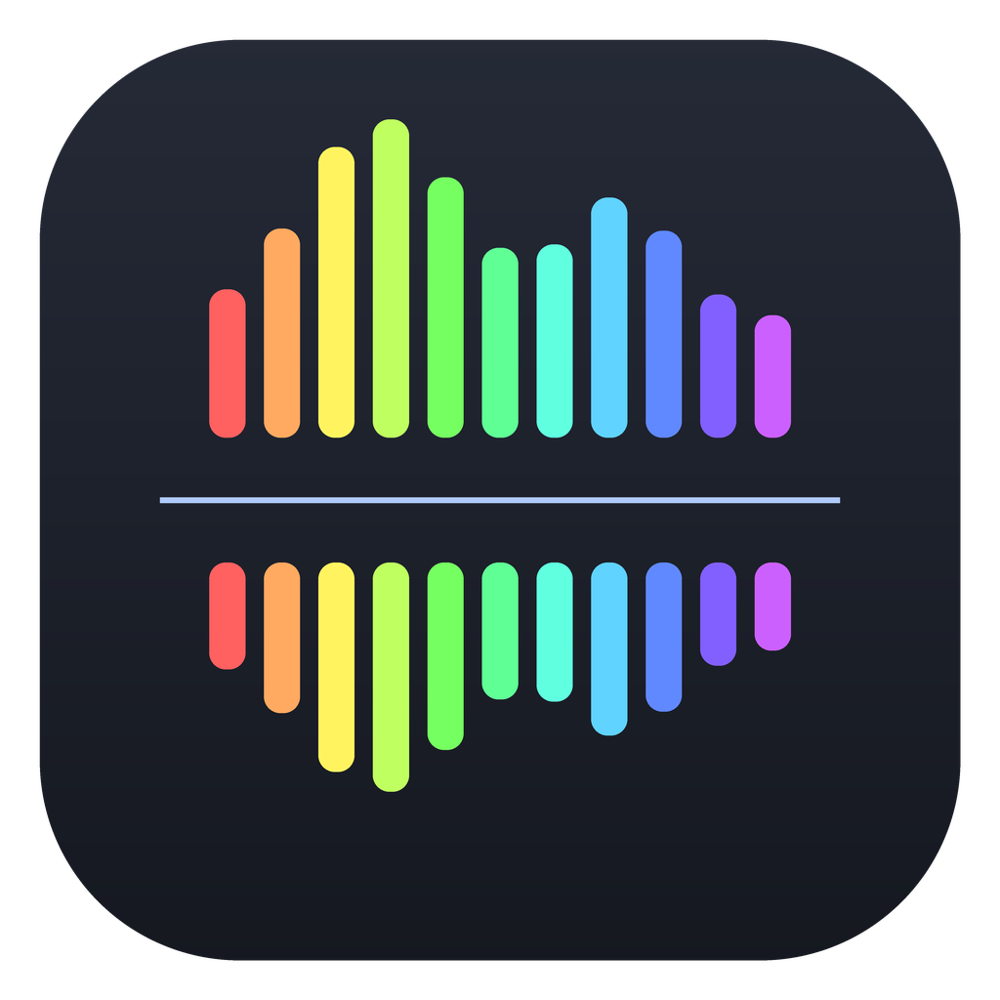

<p align="center"></p>

# SplitScope

An offline audio separation workstation. Open a song, pull out the vocals (or drums, bass, guitars and keys, lead or backing vocals, center or side channels) with one click, hear the result through a real-time EQ and multiband chain, and export any stem or the processed mix.

Runs on Windows, Linux and macOS (Apple Silicon). Nothing is sent anywhere: once the models are on disk, the program never touches the network.

## What it does

**One-click isolation.** Buttons on the left create new stems and solo the result:

| Button | Method | Notes |
|---|---|---|
| Isolate vocals / Remove vocals | AI (Kim Vocal 2 by default) | Produces Vocals and Instrumental stems |
| Lead vocal / Backing vocals | AI vocals, then the UVR Karaoke model | Without the karaoke model it splits the vocal stem by stereo position |
| Isolate drums | AI (KUIELab drums) | |
| Isolate bass | AI (KUIELab bass) | |
| Guitars / keys | AI (KUIELab "other") | This model returns everything that is not vocals, drums or bass. There is no guitar-only model, so keys and synths come along |
| Center channel / Side channels | Spectral pan analysis | No model needed. Backing vocals and double-tracked guitars are usually on the sides |
| Mid / side split | Plain L+R / L-R matrix | |
| Harmonic / perc. | Median-filter HPSS | Sustained sound vs transients |

Any stem can be separated further: use a stem's `...` menu, "Separate this stem further", then press another button. For example: Isolate vocals, then Backing vocals on the Vocals stem.

If a model is missing, its button gets a dashed border and falls back to a DSP estimate. The fallbacks are much weaker than the models (they are filters, not separation) and the status bar says so when one is used.

**Real-time processing chain** (everything you hear, and exactly what "What you hear" exports):

- Spatial: center extract, remove center, extract or remove any pan position, mid/side levels with mute, left/right only, swap. Adjustable width, phase strictness, smoothing, depth and frequency range.
- Focus: instrument frequency presets (vocal range, vocal presence, guitar, guitar solo, bass, kick, snare, cymbals, drums, sub, piano) with one or two ranges, slope, and invert.
- Parametric EQ: any number of bands (bell, shelves, low/high cut up to 96 dB/oct, notch, band pass). Each band can act on stereo, mid, side, left or right.
- 15-band graphic EQ.
- 4-band multiband with per-band level, mute, solo and compression.
- Output: gain, balance, mono, tape-style saturation, compressor, limiter.
- Playback speed 0.25x to 2x, with pitch kept (phase vocoder) or varispeed.

The whole chain runs in the frequency domain with zero-phase gains, so EQ and crossovers add no phase shift, and bypassing it gives back the input unchanged.

**Analyser.** The large display shows the spectrum after processing (prism coloured by frequency), optionally the input spectrum behind it, the combined EQ curve and draggable band nodes, plus a strip showing typical instrument ranges. Below it: a scrolling spectrogram and a waveform with loop selection.

To find where something sits (a guitar solo, a buried vocal): hold **Shift** and drag across the analyser (or drag with the middle mouse button). Playback narrows to a band around the cursor. Sweep until the part you want is loudest, release, then double-click there to drop an EQ node and boost or cut it.

## Download and run

Get the archive for your system from the [Releases](../../releases) page.

**Windows:** unzip anywhere and run `SplitScope\SplitScope.exe`. The build is not code-signed, so SmartScreen may warn on first launch: "More info", then "Run anyway".

**Linux (x86-64):** extract the `.tar.gz` and run `SplitScope/SplitScope`. Optional: run `./install-desktop-entry.sh` inside the folder to add it to your application menu. Audio goes through your system's ALSA library, which on PipeWire or PulseAudio desktops routes to them as usual. Built on Ubuntu 22.04, so it needs glibc 2.35 or newer (openSUSE Tumbleweed and Leap 15.6 are fine).

**macOS (Apple Silicon):** unzip and move `SplitScope.app` to Applications. The app is not signed or notarized, so macOS will refuse to open it until you clear the download flag once:

```
xattr -dr com.apple.quarantine /Applications/SplitScope.app
```

Intel Macs are not built. Running from source works there.

## Models

Separation uses MDX-Net networks from the [Ultimate Vocal Remover](https://github.com/Anjok07/ultimatevocalremovergui) project and [KUIELab](https://github.com/kuielab/mdx-net), run with ONNX Runtime on the CPU.

Release builds include these by default (about 210 MB):

| Model | Used for |
|---|---|
| Kim Vocal 2 | Vocals / instrumental |
| UVR MDX-Net Karaoke 2 | Lead vs backing vocals |
| KUIELab MDX-Net drums, bass, other | Drums, bass, guitars and keys |

More can be downloaded from inside the app (Models button): UVR MDX-Net Voc FT and Inst HQ 3 are alternatives for vocals. Any other MDX-Net `.onnx` can be imported; if it is in UVR's model table its settings are detected automatically, otherwise you are asked for its FFT size.

The app looks for models in this order:

1. a `models` folder next to the executable (portable use)
2. the models bundled into the build
3. your user data folder (where in-app downloads go):
   - Windows: `%APPDATA%\SplitScope\models`
   - Linux: `~/.local/share/SplitScope/models`
   - macOS: `~/Library/Application Support/SplitScope/models`

**About model licensing.** The UVR application is MIT-licensed, but the model weight files are distributed without an explicit license. Bundling them in releases is common practice in the community and the authors publish them for free use, but it is not a formal grant. If that matters for your use, build without bundled models (see below) and let users download them in the app.

### Speed

Separation runs on the CPU. In development, on a single CPU core, Kim Vocal 2 needed about 1.2 seconds per second of audio on full-length material, and short clips take proportionally longer because of padding. ONNX Runtime uses all cores, so a multi-core desktop should be several times faster, but that has not been measured on typical desktop hardware. "High quality" runs every model twice and doubles the time. Results are cached per stem, so switching between Isolate vocals, Remove vocals, Lead vocal and Backing vocals does not rerun the vocal model.

## Honest limits

- Frequency focus is a filter. "Guitar solo focus" keeps 500 Hz to 4.5 kHz, which also keeps the vocal, snare and keys in that range. Use it together with an AI stem or center/side extraction.
- There is no guitar-only model. "Guitars / keys" returns the KUIELab "other" stem.
- Center/side separation depends on the mix. Anything panned center (lead vocal, kick, snare, bass) lands in Center, anything wide lands in Sides. Mono recordings have nothing to separate, and the app tells you when a file is mono.
- Stronger spectral processing (narrow center extraction, extreme pan windows, time stretching) produces the usual phasey or watery artifacts.
- The multiband and main compressors detect level once per STFT hop (about 23 ms at 44.1 kHz). Fine for taming dynamics, too slow for transient shaping.
- Playback latency is roughly 100 to 200 ms because processing happens in 4096-sample FFT frames. Controls respond immediately, you hear the change a moment later.
- All stems are held in memory: roughly 100 MB per stem for a 5-minute stereo song.

## Export

File > Export (Ctrl+E), or a stem's `...` menu:

- What you hear: the audible stems through the chain
- Selected stem, unprocessed
- Every stem as its own file, unprocessed or each through the chain

Formats: WAV 16/24-bit and 32-bit float, FLAC 16/24-bit, MP3 (VBR), OGG Vorbis. Whole file or the loop region, optional peak normalize, optional playback speed.

Separate > "Render processing chain to new stem" bakes the current chain into a new stem and resets the chain, so you can stack steps (for example center extract first, then run a model on the result).

Import handles WAV, FLAC, MP3, OGG, Opus and AIFF directly, and M4A/AAC, WMA and video soundtracks through the bundled ffmpeg.

## Keyboard

| Key | Action |
|---|---|
| Space | Play / pause |
| Home | Return to start (or loop start) |
| L | Toggle loop (drag in the waveform to set it, right-click to clear) |
| B | Bypass the whole chain (A/B compare) |
| Ctrl+O / Ctrl+E | Open / export |
| Shift+drag in analyser | Solo a narrow frequency band |
| Delete | Remove the selected EQ band |

In the analyser: drag a node to move it, mouse wheel changes Q (or slope for cut filters), Ctrl while dragging for fine moves, double-click empty space to add a band, right-click a node for type and channel.

## Run from source

Python 3.10 or newer.

```
git clone https://github.com/NullAngst/SplitScope
cd SplitScope
python -m venv .venv
. .venv/bin/activate        # Windows: .venv\Scripts\activate
pip install -r requirements.txt
python SplitScope.py
```

On Linux, `sounddevice` needs PortAudio from your package manager (openSUSE: `sudo zypper install portaudio`, Debian/Ubuntu: `sudo apt install libportaudio2`). Without it the app still separates, analyses and exports, but cannot play audio.

`python SplitScope.py --selftest` checks every native dependency and prints a report.

## Building releases with GitHub Actions

The workflow in `.github/workflows/release.yml` builds all three platforms, runs the self-test on each frozen build (including a real model inference), and packages the result. Everything can be done from the GitHub website:

- **Publish a release:** Releases > Draft a new release > choose or create a tag such as `v1.0.0` > Publish. The workflow starts and attaches the three archives to that release after 15 to 30 minutes.
- **Test build without a release:** Actions > Build release > Run workflow. Download the archives from the run's Artifacts section. Enter a tag in the form to also create a release.

To change which models are bundled, edit `BUNDLE_MODELS` at the top of the workflow (keys from `splitscope/models.py`), or untick "Bundle AI models" when running it manually. The Linux job compiles PortAudio with ALSA support only and ships it with the build; `libasound` itself is left out on purpose so the user's system ALSA (and its PipeWire/Pulse plugins) is used.

To build locally: `pip install pyinstaller`, then `pyinstaller --noconfirm packaging/splitscope.spec`. See the comments at the top of the spec for the environment variables it reads.

## Project layout

```
SplitScope.py                  entry point
splitscope/
  app.py                       Qt application setup, --selftest
  engine.py                    playback engine (PortAudio via sounddevice)
  separation.py                one-click isolation recipes and caching
  models.py                    model registry, download, import, search paths
  audio_io.py                  import/export (libsndfile, ffmpeg fallback)
  dsp/mdx.py                   MDX-Net inference (NumPy STFT + ONNX Runtime)
  dsp/chain.py                 chain settings and compiled real-time parameters
  dsp/processor.py             STFT processing chain (real-time and offline)
  dsp/curves.py                EQ, focus, crossover and multiband curves
  dsp/dsp_separate.py          HPSS, mid/side, center/sides
  ui/                          widgets and windows
packaging/splitscope.spec      PyInstaller build
tools/make_icon.py             regenerates assets/icon.*
tools/fetch_models.py          downloads models for bundling
```

## Credits and license

SplitScope is licensed under the GNU General Public License v3.0 or later (see `LICENSE`).

- Separation models: Ultimate Vocal Remover (Anjok07, aufr33 and contributors, including Kim's vocal model) and KUIELab MDX-Net. `splitscope/resources/uvr_mdx_model_data.json` is the model parameter table from UVR, used to configure imported models. See `THIRD_PARTY.md`.
- Libraries: Qt / PySide6 (LGPLv3), NumPy, SciPy, ONNX Runtime (MIT), libsndfile via soundfile (LGPL), PortAudio via sounddevice (MIT), ffmpeg via imageio-ffmpeg (LGPL/GPL builds).
